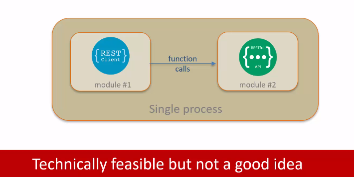
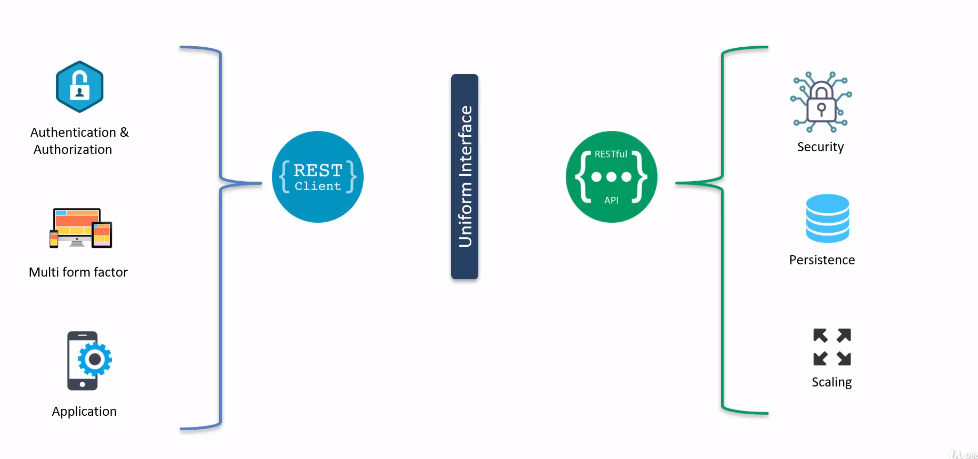

# REST API Architecture Constraint

## Client-Server
*"REST application should have Client-Server architecture"*

  - Client: Requests the resources
  - Server: serves tge resources as a response. Server may serve multiple resources and multiple clients.

> Client-Server should NOT run in same process

  

So technically this is feasible, but it's definitely not a good idea as the client component and the server component will be very tightly coupled. Such tight couple will lead to many challenges. And most times it may not even be possible to package the client and server in the same process to achieve highest level or decoupling between the client and the server. The client will make request to the server or some kind of network.  This way, the client and server can change independently without impacting each other.  

This decoupled architecture leads to what is known as the separation of concerns. 

The client and the server in have a different set of concerns that they need to address and manage on the server end.
  

The two NS can continue to independently manage these concerns without impacting the other end, as long as the uniform interface between the client and the server is maintained.

Another advantage of the decoupled architectural approach is that the client and the server can evolve independently. 

- The client server architecture constraint provides the foundation for the implementation of risk APIs.
- This architectural style is suggested as it leads to decoupling between the client.
- The client side and the server side can change without impacting the other site as long as the uniform interface is maintained.
- Another advantage is separation of concern.  A different set of concerns that they can manage independently, the client and the server can evolve over a period of time in an independent fashion.