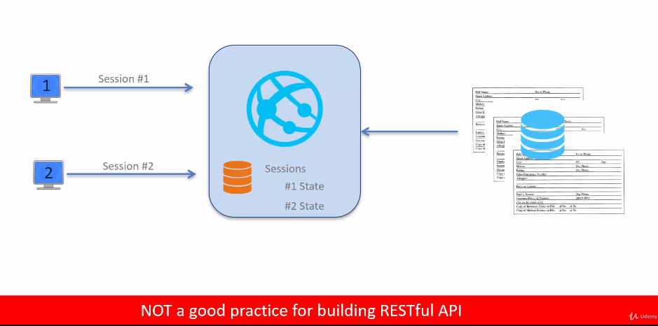

# REST API Architecture Constraint

## Client-Server
*"REST application should have Client-Server architecture"*

  - Client: Requests the resources
  - Server: serves tge resources as a response. Server may serve multiple resources and multiple clients.

> Client-Server should NOT run in same process

  

So technically this is feasible, but it's definitely not a good idea as the client component and the server component will be very tightly coupled. Such tight couple will lead to many challenges. And most times it may not even be possible to package the client and server in the same process to achieve highest level or decoupling between the client and the server. The client will make request to the server or some kind of network.  This way, the client and server can change independently without impacting each other.  

This decoupled architecture leads to what is known as the separation of concerns. 

The client and the server in have a different set of concerns that they need to address and manage on the server end.
  

The two NS can continue to independently manage these concerns without impacting the other end, as long as the uniform interface between the client and the server is maintained.

Another advantage of the decoupled architectural approach is that the client and the server can evolve independently. 

- The client server architecture constraint provides the foundation for the implementation of risk APIs.
- This architectural style is suggested as it leads to decoupling between the client.
- The client side and the server side can change without impacting the other site as long as the uniform interface is maintained.
- Another advantage is separation of concern.  A different set of concerns that they can manage independently, the client and the server can evolve over a period of time in an independent fashion.

___

## Uniform Interface

*"Client and Server share a common Technical Interface"*
  - interface  defines the contract between the client and the server
  - technical implies that there is no business context for this contract.

There are 4 guiding principles used for defining the contract between the client and the server and they are: 

  - **Individual resources are identified in the Request (URI/URL)**  
  - **Representation of the resources**  
  may be used by the client to manipulate the resource state.
  - **Self descriptive messages - metadata**  
  the messages are self descriptive. There is metadata contained in the request and responses that can be used by the client and the server.
  - **Hypermedia**  
  server can only send back responses but hypermedia links that can be used by the client for further discovery of resources.

> Uniform Interface = Contract between client and server

___

## Statelessness

*"Client MUST manage its own state thus making the server stateless"*

**Typical Web Application**
  
For every client that is connecting to the Web application, the Web application manages the state independently. This practice of managing the state in the server is not considered a good practice for building RESTful APIs.

> The RESTful API server does not manage the state of the client. Each of the client connecting to the RESTful Apps server manages its own state.

The management implementation is left to the client application and is not governed or defined by the REST API server.


The benefit of this approach is that it simplifies the implementation of the RESTful API. It allows the API server to easily scale horizontally and it reduces the resource need for the observer.

The request received from the client applications or address clients are self-contained. And what that means is that server receives all of the state information that it needs for processing the client request.

> Server receives state info from the client applications

> Each request received by the server is treated as an independent request without regard to any previous request from the same client or from other clients.


___

## Caching

The API client is responsible for managing its own state. This architectural pattern has some challenges.  

The first challenges that it can lead to increased chattiness of the application. In other words, the application may have to make multiple calls to the rest of the server to get the resource representation the size of the request data sent by the client to the server will increase as a result of the fact that the client has to send the state data along with the request data. And overall, the performance of the application may be great because of the increased chattiness and the size of data being sent from the client today.

The caching constraint suggest *"Use Caching to achieve higher Scalability and Performance"* of the REST application and server.  

Caching counterbalances the negative effect of the stateless server implementation. 

  

There are multiple points within the apartment which can take advantage of caching. The developer of the API may decide to put caching in front of the database. By doing so, the developer can get better performance. From the database perspective, developer can create a local cache within the server to cache the data from the database and also to cache the responses that it'll send to the rest.These caches are in control of the API designer or develop an application using the rest client can also cache the responses locally. This way, the application can avoid making calls to the API server and use the data from the local cache or the application level. Caching will lead to better performance of the application and higher scalability for the apps server between the application and the API. 

So there are various intermediate devices such as proxies and gateways. These proxies and gateways also have caches built into them, and these caches can further improve the performance and reduce the complexity of the client and server. From caching perspective, the developer of the API does not have full control on how the caching is carried out by the application and the intermediaries.

> Server should specify Cache-Control Directives in response to control Caching behavior

The API server can send cache control directives in the responses to control the caching behavior on applications and the intermediaries. 

> Not all responses can be cached. For example, stock prices. The server should mark those responses explicitly as the **non-cacheable response**

Cache-Control directives are specified in HTTP headers in Response. The HTTP header `Cache-Control` is used to define the cache policies. 

> `Cache-Control`  HTTP Header for defining cache policies. The value in the Cache-Control consists of multiple directives which are separated by commas. Some directives have an optional argument.

```shell
Eg: cache-control: public, max-age=6400
```

Caching Control Directives
- `No-Store` Responses aren't allowed to be cached
- `Private` Cache ONLY on user device
- `Public` Resource may be cached by any cache
- `Max-Age` Time in seconds for cache expiry

Caching Control Directives
- `Expires` Set exact Date/Time in GMT when the resource will get expired
- `Last-Modified` Set Date/Time when the resource was last changed
- `ETag` Unique identifier associated with a response

> Caching is used for Scalability and Performance  

> Server controls caching behavior on client via Cache Directives. For REST/HTTP these cache directives are specified by way of HTTP headers i.e `Cache-Control`. There are additional headers related to the caching behavior `expires`, `last modified` and `ETag`.

___

## Layered System

The Gateway is aware of only the REST API server and the server is aware of only the database layer. Each of these layers have a unique directional dependency on the layer next to it.  The

Now let's say for a specific API, the load on the server has increased to a higher level and there is a need to scale the API.  

**How to do that?**  

You may add a load balancer, which is a new layer between the Gateway and the rest API server, and then increase the number of IPS servers to carry out horizontal scaling.
But this approach, we have added a new layer and we have updated an existing layer. And we did all of this without impacting the risk line because the risk line is dependent only on the gateway. One important role to keep in mind regarding the layered architecture is that a layer can only connect with the layer that it is dependent on. It cannot bypass its dependencies and reach out to other leaders.  

  


For example, the gateway cannot bypass the load balancer and reach out directly to an instance of the REST API server. This is technically feasible, but it is not the right practice as it will render the layered architecture useless in this case. 

**Advantage of Layered Architecture**  

- Layering simplifies the architecture due to reduced dependencies.
- The architecture may evolve with changing needs
- Layer changes at most impacts ONLY one other layer

  

This constraint suggests that one should build the API using the layered architecture approach. Each layer is dependent only on one layer and the dependency is unidirectional. This approach simplifies the architecture and makes it easy to manage changes in the various layers.

___

## Code on Demand 

*"Server can extend the functionality of client by sending code"*

> This is an optional constraint.
