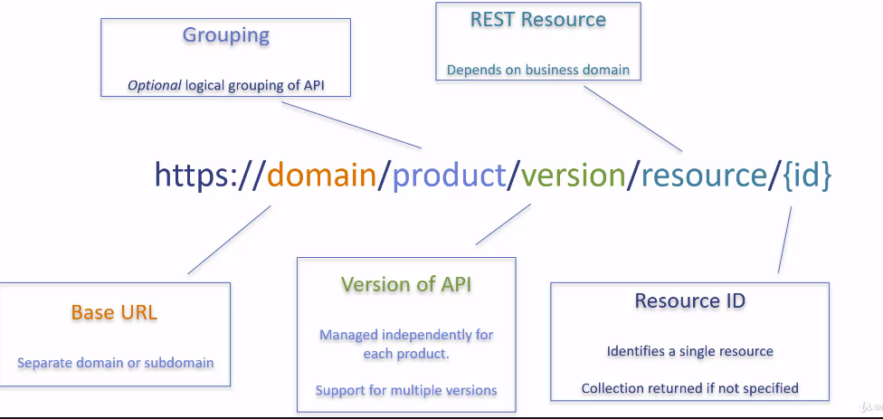
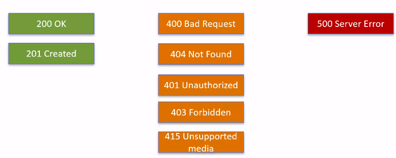

## Designing REST APIs

- API Endpoint URL

`https://domain/product/version/resource/{id}`

- Resource names should be nouns; Use of plurals is suggested. 
- Action can be verbs; may be standalone or apply to specific resource
- for Resource relationship use pattern as follow:   
Eg: People have Followers  
`/people/{id}/followers/{id}`
avoid nesting over 3levels for associated resources

> Think about the end consumer's experience while building APIs.

- API sends error in combination of Header and Body. 
1. Error Information ONLY in HTTP header using `Status-Code`, `Reason-Phrase` and `x-Custom-Header`(for additional info)
2. Error info ONLY in body (Least preferred approach)
3. Error info in Header + Body (Preferred approach)

- HTTP Codes:
Limit the no.; average 10 codes in use.   
Limiting no. helps team to maintain consistency.
