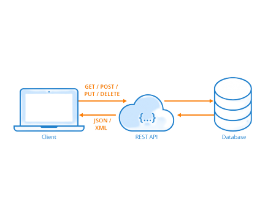
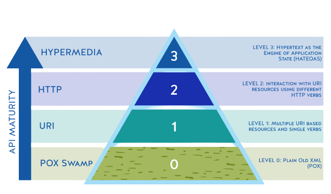
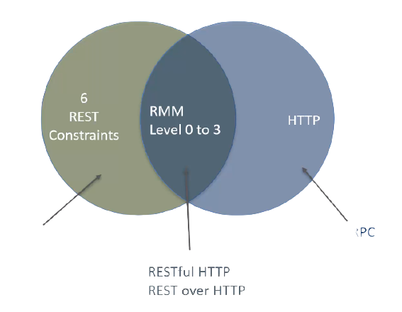

# RESTful API 

> API is the acronym for **"Application Programming Interface"**. It is a software that allows two applications to communicate with each other over the internet and through various devices.

A RESTful API is an architectural style for an application program interface (API) that uses HTTP requests to access and use data. That data can be used to GET, PUT, POST and DELETE data types, which refers to the reading, updating, creating and deleting of operations concerning resources.

 

## Origin and evolution

REST is an alternative to methods such as SOAP (Simple Object Access Protocol) and WSDL (Web Services Description Language). It was developed towards the end of the 1990s and fundamentally changed the API landscape.  

The first companies to use a REST API were eBay and Amazon. Only a selection of partners got access to eBay’s well documented and user-friendly REST API. As a result, eBay’s marketplace was not only accessible through direct visits but through any website that accessed the eBay API.

## Q. What makes Architecture RESTful ? 

In order for the application architecture to be qualified as RESTful, it must follow six design rules. And these six design rules are referred to as the rest architectural constraints.  

> The six architectural constraints for restfulness were described by Roy Fielding in his dissertation paper in year 2000.  

**The six principles of REST**

- **Client-server architecture** 
The principle behind the client-server architecture is the separation of problems. Dividing the user interface from data storage improves the portability of that interface across multiple platforms. It also has the advantage that different components can be developed independently from each other.  

- **Uniform interface**
All components of a RESTful API have to follow the same rules to communicate with each other. This also makes it easier to understand interactions between the various components of a system.  

- **Statelessness**
Statelessness means that the communication between client and server always contains all the information needed to execute the request. There is no session state on the server, it is kept entirely on the client. i.e. the server should not manage the state of the application. If access to a resource requires authentication, the client must authenticate itself on each request. 

- **Caching**
The client, server, and any intermediate components can cache all resources to improve performance. The information can be classified as cacheable or non-cacheable.

- **Layered system**
Individual components cannot see beyond the immediate level they interact with. This means that a client that connects to an intermediate component such as a proxy does not know what is behind it. Therefore, components can be easily exchanged or expanded independently of each other.

- **Code-on-demand** *(optional constraint)*
Additional code can be downloaded to extend client functionality. However, this is optional because the client may not be able to download or execute this code.

> **Richardson maturity model** provides a way to measure the RESTfulness of an API architecture or API implementation. The idea here is that the architecture for API is evaluated for maturity and it is assigned a score and the score is between zero and three.

## Summing-Up

____

## REST API constraint 
[Click here to read more about REST API constraint](./Constraints)

## The advantage of REST for the development of an API

The complete separation of the user interface from server and data storage offers some advantages for the development of an API. For example, it improves the portability of the interface to other types of platforms, increases project scalability and allows different components to be developed independently. Developers can easily migrate to other servers or make changes to the database, provided the data is sent correctly from each request. The separation thus increases overall flexibility in development.  

A REST API is always independent of the type of platform or languages used, it adapts to the type of syntax or platform used. This provides great freedom when changing or testing new environments within a development. You can use PHP, Java, Python or Node.js servers with a REST API. Only responses to requests must be in the language used for information exchange, usually XML or JSON.

> One disadvantage of REST APIs is the lack of standardization, which can lead to misunderstandings.

